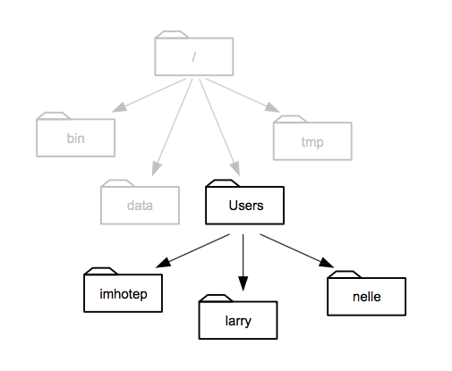

# Loading your own data

1. Questions:
- How do I use _my_ data?
2. Objectives:
- Preparing a csv file in 'tidy' format
- Understanding file system paths
- Loading a file to a dataframe
- Explicitly describing the file contents
3. Keypoints:
- Data needs to be in a particular format for `ggplot` to work
- Specifying the data type is sometimes necessary when creating a data frame.

## Tidy data

There are many ways to structure data. Here are two quite common ones.

<table><th></th><th>treatmenta</th><th>treatmentb</th>
<tr><td>John Smith</td><td> 11 </td><td> 2</td></tr>
<tr><td>Jane Doe</td><td> 16 </td><td> 11</td></tr>
<tr><td>Mary Johnson</td><td> 3 </td><td> 1</td></tr>
</table>

<table><th></th><th>John Smith</th><th>Jane Doe</th><th>Mary Johnson</th>
<tr><td>treatementa</td><td>11</td><td>16</td><td>3</td></tr>
<tr><td>treatementb</td><td>2</td><td>11</td><td>1</td></tr>
</table>

_source:_ [Hadley Wickham ](http://vita.had.co.nz/papers/tidy-data.pdf) 	

Tables contain two things, variables and values for those variables. In these two tables there are only three variables.  `treatment` is one, with the values `a` and `b` . The second is 'name', with three values hidden in plain sight, and the third is `result` which is the value of the thing actually measured for each person and treatment.

For human reading purposes, we don't need to state the variables explicitly, we can see them by interpolating between the columns and rows and adding a bit of common sense. This mixing up of variables and values across tables like this has led some to call these tables 'messy'. A computer finds it hard to make sense of a messy table.

Working with R is made much less difficult if we get the data into a 'tidy' format. This format is distinct because each variable has its own column explicitly, like this  

<table><th>name</th><th>treatment</th><th>result</th>
<tr><td>John Smith</td><td>a</td><td>11</td></tr>
<tr><td>Jane Doe</td><td>a</td><td>16</td></tr>
<tr><td>Mary Johnson</td><td>a</td><td>3</td></tr>
<tr><td>John Smith</td><td>b</td><td>2</td></tr>
<tr><td>Jane Doe</td><td>b</td><td>11</td></tr>
<tr><td>Mary Johnson</td><td>b</td><td>1</td></tr>
</table>

Now each variable has a column, and each seperate observation of the data has its own row. It is _much_ more verbose for a human, but R can use this easily because we are now explicit about what is called what and how it relates to everything else.

## Getting your data into tidy format

The bad news here is that there is no magic function to make your data tidy. If you have an existing table then you can do this manually in Excel or some other spreadsheet package. If you have lots of data, it is possible to do it programmatically in R, see the `dplyr` and `tidyr` packages, which are complex but designed for this purpose. Also have a look at the cheat-sheet here [https://www.rstudio.com/wp-content/uploads/2015/02/data-wrangling-cheatsheet.pdf](https://www.rstudio.com/wp-content/uploads/2015/02/data-wrangling-cheatsheet.pdf).


## Loading in a CSV file

R can deal with a lot of file formats, but the most common and easily used one is 'csv', a comma-separated value file. These can be exported from virtually any spreadsheet program so it's a good interchange format to get data into R from wherever you already have it. Loading a file is done easily with the `readr` package`. 

`readr` is a tool for loading data into R. It can be loaded on its own with `library(readr)`. We will use `readr` to load in data from a 'flat' `.csv` file.  


### read_csv()

The main function is `read_csv()` which can read a standard comma seperated values file from disk into an R dataframe. There are a few variants of `read_csv()` which may be appropriate for different sorts of `.csv` file, but they all work the same.

  * `read_csv2()` - reads semi-colon delimited files, which are commonly used where a comma is used as a decimal separator
  * `read_tsv()` - reads tab delimited files
  * `read_delim()` - reads files delimited by an arbitrary character
  
The first argument to `read_csv()` is the path to the file to read. Here I'll read a file on my Desktop that contains the diamonds data we've been using.

```{r,echo = TRUE, eval=FALSE}
library(readr)
read_csv("~/Desktop/diamonds.csv")
```

This will create an object called a dataframe that can be used just like the built-in data.

## Finding the file

R needs to be given the correct and full path to a file. This means the full address of the file on the hard disk of your computer. R doesn't have a file chooser so you need to know how to write this down.

Computer file systems are laid out in folders and sub-folders with files inside them. Conceptually, this results in a tree of folders and a path down the branches from the root of the tree to everything else. The root gets called '/' on Mac/Linux computers and 'C:\' on Windows computers  


_source:_ [Software Carpentry](http://swcarpentry.github.io/shell-novice/fig/home-directories.svg) 	
	
This picture of an example file system shows how that is formed. When we write this down, everytime we go inside a new folder we use a slash to show we've changed folder.   Most computer systems have a 'Users' or similar folder in which each users stuff is stored. Supposing we're in Larry's folder then the path would be `/Users/larry`. And a file called `my_file.txt` in that folder would be `/Users/larry/my_file.txt`. 

So to write the full file path for R we can use this pattern, the first bit would be `/Users/username/` (or `C:\Documents and Settings\username\` or `C:\Users\username\`) and then the set of folders within that user area follows on. If your file `my_file.txt` is on the Desktop the full path would be `/Users/username/Desktop/my_file.txt` (or `C:/Documents and Settings/username/Desktop/my_file.txt`)

### Make it easy on yourself

The easiest way not to have to think too hard about this stuff is to set up a consistent folder and file structure for every analysis and use RMarkdown documents to run your analysis. Here's an example scheme:

1. Create a new folder and call it something relevant to your experiment, e.g `disease_incidence_2019-11-01` 
2. Within the folder create a sub-folder called `raw` and a sub-folder called `output_images`.
3. Put your tidy csv file in the `raw` folder.
4. Create a new R Markdown document and save it in the `disease_incidence_2019-11-01` folder.

Now whenever you open and run that R Markdown document, the path of your input file is `"raw/my_input_filename.csv"`.
You can save your plots with the `ggsave()` function to `"output_images/filename.png"` (don't forget the quotes). 

If you never mess around with the relative positions of the files and folders described, then the paths will always be the same. You can move the whole folder without worrying, just don't jumble it's contents.


## Making sure the data types are correct

When we load new data we need to make sure that any header has been properly parsed as column names, and that the columns have been identified as the right sort of data

On loading with `readr` we see a column specification, `read_csv()` has guessed at what the columns should be and made those types. Its fine for the most part, but some of those columns we'd prefer to be factors. We can set our own column specification to force the column types on loading. We only have to do the ones that `read_csv()` gets wrong. Specifically, lets fix `cut` and `color` to a `factor`. We can do that with the `col_types` argument.

```{r,eval=FALSE}
read_csv("~/Desktop/diamonds.csv",
    col_types = cols(
      cut = col_factor(NULL),
      color = col_factor(NULL)
    )
)

```

### Parser functions

This works by assigning a parser function that returns a specific type to each column, here it's `col_factor()`.  There are parser functions for all types of data, and all of them can be used if `read_csv()` doesn't guess your data properly. We won't go into detail of all of them, just remember that if your numbers or dates or stuff won't load properly, there's a parser function that can help.


Once the specification shows what you expect, then you are good to start analysing. 

## Quiz
	1. Make a new folder called `analysis` on the Desktop
	2. Inside `analysis` make a new folder called `raw` and put `example_ros_data_flg22.xlsx` into it.
	3. Start a new R Markdown document and save it in `analysis`
 2. Convert `raw/example_ros_data_flg22.xlsx` into a 'tidy' format .csv file and save to `raw`
 3. Load in the data from the tidy file using `read.csv()` (Hint: You may need to save a csv version from Excel - R won't read .xlsx files.)
 4. Check the datatypes and headers using `str()`, change them if necessary.
 5. Create a plot that shows each data point in each treatment (Col, pp2c38, pp2c48 pp2c38/pp2c48) in each day the experiment was done. 
 6. Make sure the plot you generate gets saved to a folder inside `analysis` called `output_images`
