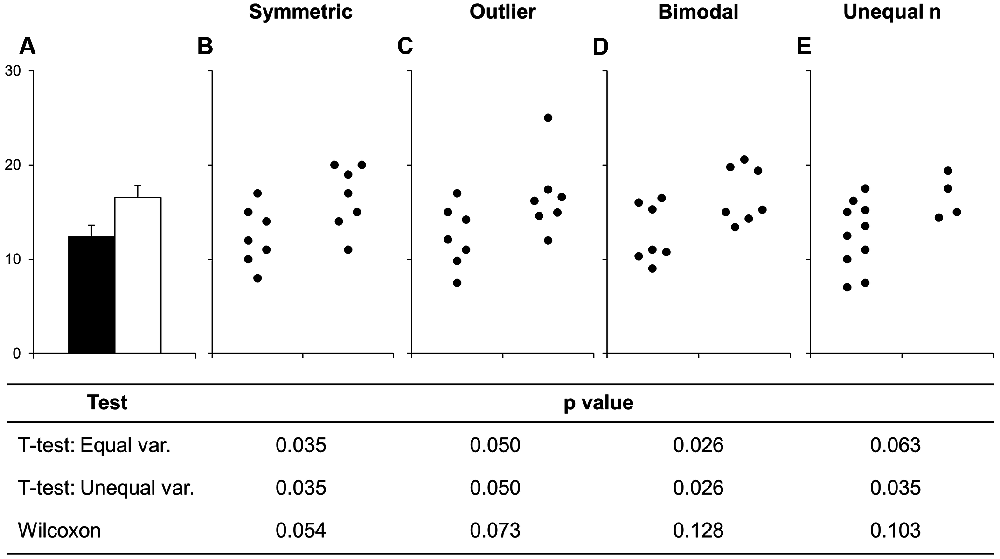
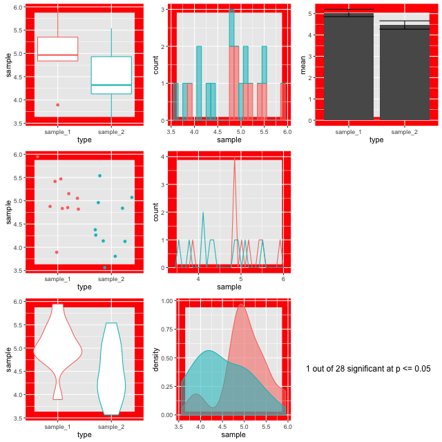
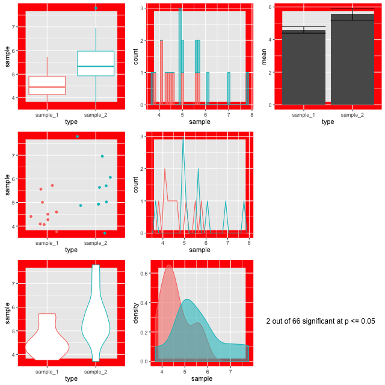

# Motivation

## Variability in measurements

Variability in measurements is a thing that happens as a natural consequence of working with complex systems that are affected by many variables in stochastic ways. Biological systems are some of the most variable we know. The variability in our experiments could be a function of the behaviour of the system yet it is common practice to hide that variability when we start to analyse our data by using summary plots like box-plots.  Ultimately, that's bad news for our science, because the variability could be telling us something.

## Summarising your data can lead to wrong conclusions

We all know that when you create a bar chart and put some error bars on it, you're really only representing two numbers, usually a mean and standard deviation. People create bar plots instinctively, and in doing so can miss important stuff. Look at this figure:  

_source:_ [Weissgerber et al ](http://journals.plos.org/plosbiology/article/figure/image?size=large&id=info:doi/10.1371/journal.pbio.1002128.g001) 	

The bar chart in panel A is one that came out of all those sets of numbers in the other panels. But it really hides some important stuff, like the fact the numbers are clearly separating into two groups in panel D, or that the two samples have different sizes in panel E.

Worse than any of these is that the significant difference in the t-test is coming from just one point in panel C. From this data set you might be tempted to conclude that there is a significant difference in the two samples and if you relied on the bar chart as a visualisation then you'd never suspect there was something funny.  

Some enthusiastic young science communicators have even started a Kickstarter to lobby journals to stop using, in particular, bar charts! These people, calling themselves Bar Barplots, have a nice video on one of the main problems with  bar charts. Have a look at this page on Kickstarter . [Kickstarter - Barbarplots](https://www.kickstarter.com/projects/1474588473/barbarplots), especially this video [Kickstarter - Barbarplots video ](https://ksr-video.imgix.net/projects/2453455/video-665338-h264_high.mp4).

Ignoring your data visualisation and just making bar plots could be an error! It's important that you spend a little time getting to know, and presenting your data as clearly and thoroughly as possible. 

## _p_ - one value to fool them all?

But why would you care about this, in the end a _p_-value won't a _p_-value help you see real differences and make this all easy? Sadly, that isn't true. Let's do an experiment to test that.

### Ten Thousand Random Numbers
Below is a set of figures that show different views of the same set of data. Every frame of the 100 frames shows a different sampling from the same pool of 10,000 random normally distributed numbers.

Step-by-step, here's how these figures are made.

1. Generate a pool of 10,000 random numbers (mean 5, sd 1)
2. From that, select 10 and call it sample 1.
3. Select another 10, call it sample 2.
4. Draw plots comparing each sample
5. Do an independent _t_-test on the sample 1 and sample 2 to test for significant differences in means.

The figures are plotted with a red border if _p_ comes up less than 0.05. The thing is, the samples are from the same background pool, so intuitively you might suspect that none should be different from the others. The reason that some of them do is because a _p_ value only states that the difference observed occurs by chance in _p_ of all events, so for 100, we'd expect 5 to be marked out by chance. In this run of the experiment we get three. Here they are:

Look at the different plots for each. It is observable that for all these the barplots look very convincingly different. But in the context with the other plots its clear that they aren't showing the whole of the story (or in fact much of it). The boxplots (top left) do a good job of showing the range and the violin and density plots (bottom row) do a good job of showing the shape. It is only really the point plot (first column, middle row) that reveals the positions of the data points and shows that the conclusion of the _p_ value is likely skewed by one or two points in each sample. Concluding differences on this basis is _really_ unsafe. 

Hence, the conclusion from this is that a range of visualisations is necessary to allow us to have confidence in our _p_ values and understand the shapes of our data. Drawing box plots and sticking to _p_ religiously is going to make us wrong more than we'd like! 

## _ggplot2_ An R package for beautiful visualisations

In this tutorial we are going to use _ggplot2_ a package in R to make some clear, informative, thorough visualisations that will help us with our analysis. Here's an example of the sort of thing you can get from _ggplot_:

_ggplot2_ is a library in the R statistical programming language - but we won't be learning to program here. The _gg_ part stands for 'grammar of graphics', and _ggplot2_ is a small grammar that describes plots that should be built on top of data - effectively allowing a user to write their own plot description and have the computer work out what to do, so no programming is needed, just an appreciation of the grammar that is used to describe the plot.
