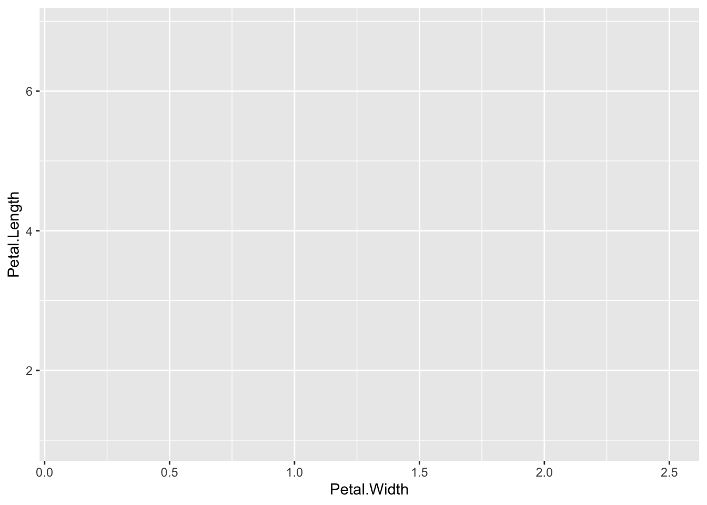
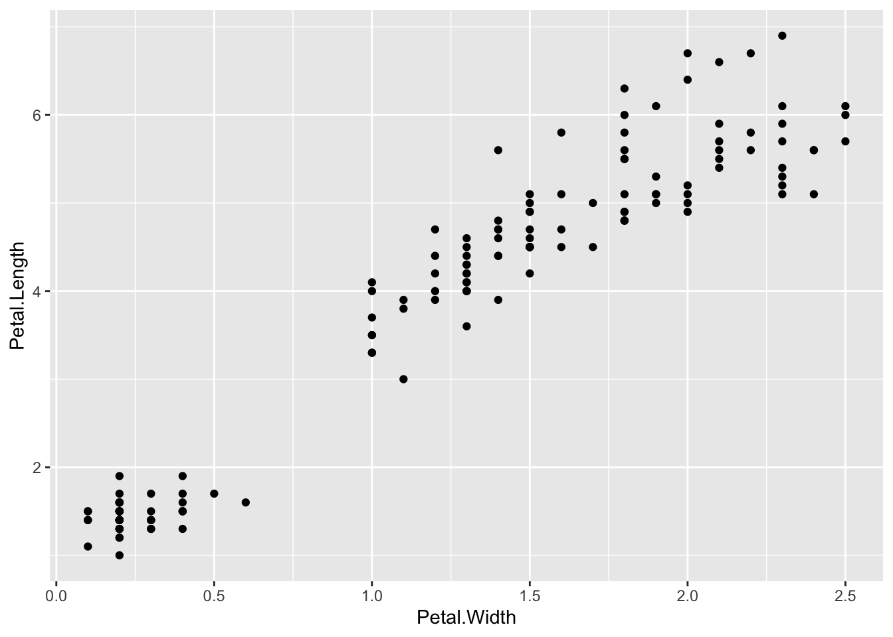
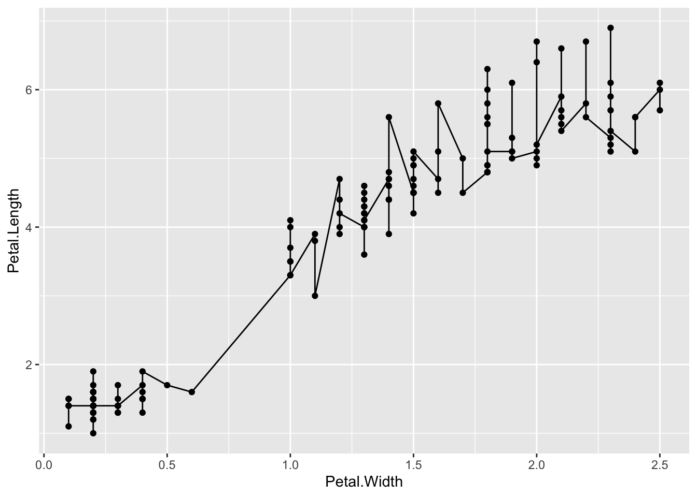
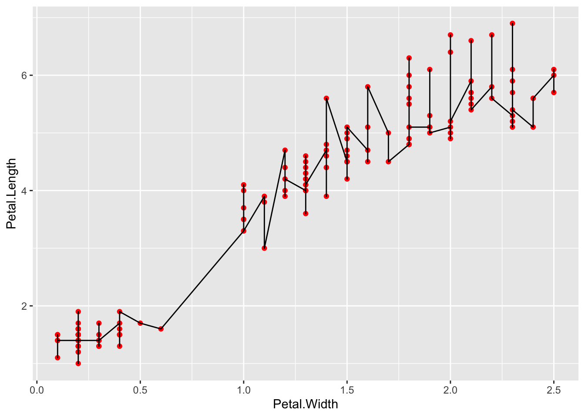
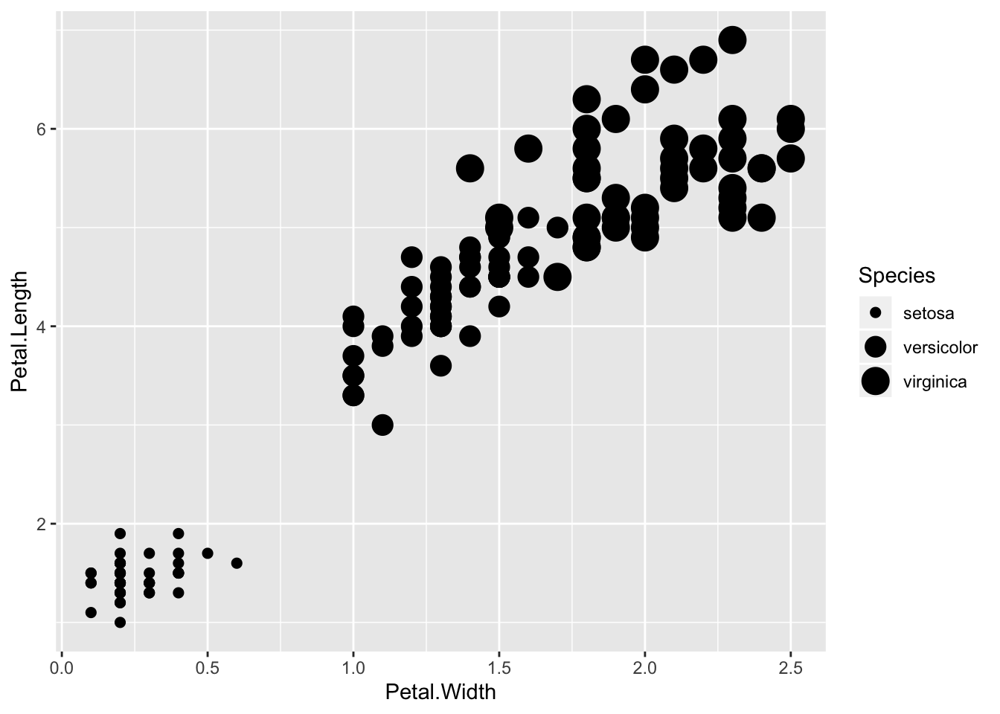
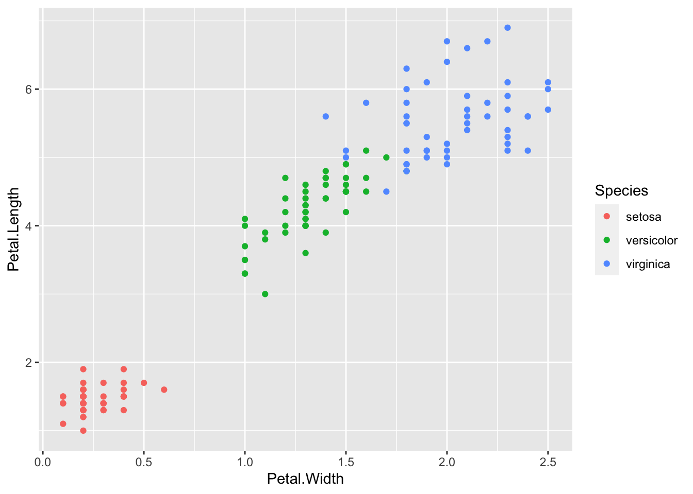
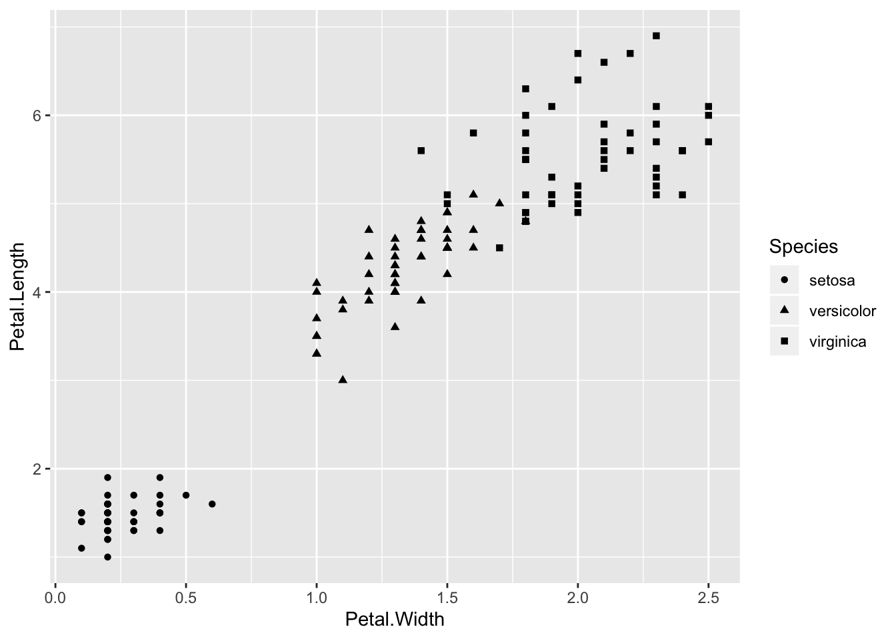
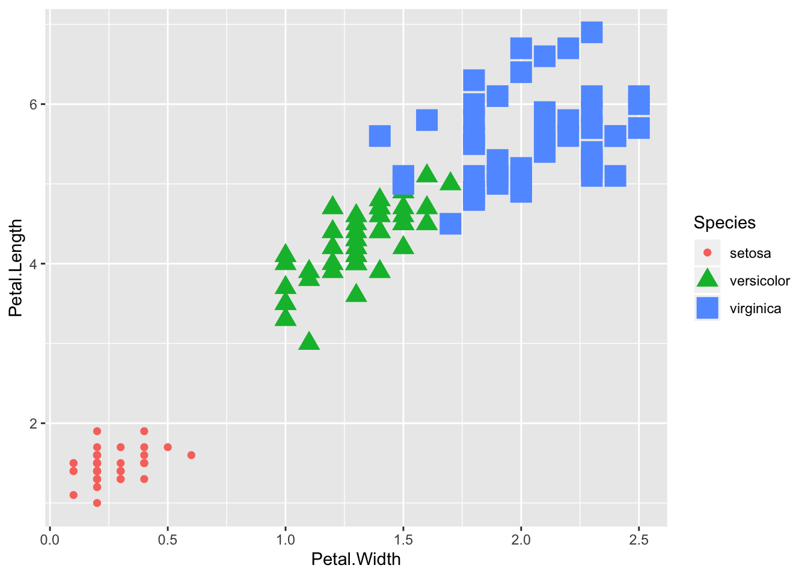

# _ggplot2_ Tour

## About this chapter

1. Questions:
  - How does ggplot2 work?
2. Objectives:
  - Explain the structure of a ggplot2
  - Explain the flexibilty of the structure
3. Keypoints:
 - ggplot2 plots are made in user defined layers
 - Using layers helps us to change plot types quickly or build progressively more complex charts

## Building a plot with _ggplot2_
Loading _ggplot2_ into memory so we can use it is very easy. With RStudio started, and in the console window type:


```r
library(ggplot2)
```

Nothing should happen, thats a good sign!

> ## It didn't load - I got an error
> You need to go back and look at the install instructions, using the packages tab in the bottom right hand window of R studio, click `install` and type `ggplot2` into the window that appears. Select `install` and it should automatically install. If this doesn't work seek some expert help. 
{: .callout }

### Loading the iris test data

R has some datasets built in that allow us to easily develop analysis. Let's look at the `iris` data


```r
iris
```

```
##     Sepal.Length Sepal.Width Petal.Length Petal.Width    Species
## 1            5.1         3.5          1.4         0.2     setosa
## 2            4.9         3.0          1.4         0.2     setosa
## 3            4.7         3.2          1.3         0.2     setosa
## 4            4.6         3.1          1.5         0.2     setosa
## 5            5.0         3.6          1.4         0.2     setosa
## 6            5.4         3.9          1.7         0.4     setosa
## 7            4.6         3.4          1.4         0.3     setosa
## 8            5.0         3.4          1.5         0.2     setosa
## 9            4.4         2.9          1.4         0.2     setosa
## 10           4.9         3.1          1.5         0.1     setosa
## 11           5.4         3.7          1.5         0.2     setosa
## 12           4.8         3.4          1.6         0.2     setosa
## 13           4.8         3.0          1.4         0.1     setosa
## 14           4.3         3.0          1.1         0.1     setosa
## 15           5.8         4.0          1.2         0.2     setosa
## 16           5.7         4.4          1.5         0.4     setosa
## 17           5.4         3.9          1.3         0.4     setosa
## 18           5.1         3.5          1.4         0.3     setosa
## 19           5.7         3.8          1.7         0.3     setosa
## 20           5.1         3.8          1.5         0.3     setosa
## 21           5.4         3.4          1.7         0.2     setosa
## 22           5.1         3.7          1.5         0.4     setosa
## 23           4.6         3.6          1.0         0.2     setosa
## 24           5.1         3.3          1.7         0.5     setosa
## 25           4.8         3.4          1.9         0.2     setosa
## 26           5.0         3.0          1.6         0.2     setosa
## 27           5.0         3.4          1.6         0.4     setosa
## 28           5.2         3.5          1.5         0.2     setosa
## 29           5.2         3.4          1.4         0.2     setosa
## 30           4.7         3.2          1.6         0.2     setosa
## 31           4.8         3.1          1.6         0.2     setosa
## 32           5.4         3.4          1.5         0.4     setosa
## 33           5.2         4.1          1.5         0.1     setosa
## 34           5.5         4.2          1.4         0.2     setosa
## 35           4.9         3.1          1.5         0.2     setosa
## 36           5.0         3.2          1.2         0.2     setosa
## 37           5.5         3.5          1.3         0.2     setosa
## 38           4.9         3.6          1.4         0.1     setosa
## 39           4.4         3.0          1.3         0.2     setosa
## 40           5.1         3.4          1.5         0.2     setosa
## 41           5.0         3.5          1.3         0.3     setosa
## 42           4.5         2.3          1.3         0.3     setosa
## 43           4.4         3.2          1.3         0.2     setosa
## 44           5.0         3.5          1.6         0.6     setosa
## 45           5.1         3.8          1.9         0.4     setosa
## 46           4.8         3.0          1.4         0.3     setosa
## 47           5.1         3.8          1.6         0.2     setosa
## 48           4.6         3.2          1.4         0.2     setosa
## 49           5.3         3.7          1.5         0.2     setosa
## 50           5.0         3.3          1.4         0.2     setosa
## 51           7.0         3.2          4.7         1.4 versicolor
## 52           6.4         3.2          4.5         1.5 versicolor
## 53           6.9         3.1          4.9         1.5 versicolor
## 54           5.5         2.3          4.0         1.3 versicolor
## 55           6.5         2.8          4.6         1.5 versicolor
## 56           5.7         2.8          4.5         1.3 versicolor
## 57           6.3         3.3          4.7         1.6 versicolor
## 58           4.9         2.4          3.3         1.0 versicolor
## 59           6.6         2.9          4.6         1.3 versicolor
## 60           5.2         2.7          3.9         1.4 versicolor
## 61           5.0         2.0          3.5         1.0 versicolor
## 62           5.9         3.0          4.2         1.5 versicolor
## 63           6.0         2.2          4.0         1.0 versicolor
## 64           6.1         2.9          4.7         1.4 versicolor
## 65           5.6         2.9          3.6         1.3 versicolor
## 66           6.7         3.1          4.4         1.4 versicolor
## 67           5.6         3.0          4.5         1.5 versicolor
## 68           5.8         2.7          4.1         1.0 versicolor
## 69           6.2         2.2          4.5         1.5 versicolor
## 70           5.6         2.5          3.9         1.1 versicolor
## 71           5.9         3.2          4.8         1.8 versicolor
## 72           6.1         2.8          4.0         1.3 versicolor
## 73           6.3         2.5          4.9         1.5 versicolor
## 74           6.1         2.8          4.7         1.2 versicolor
## 75           6.4         2.9          4.3         1.3 versicolor
## 76           6.6         3.0          4.4         1.4 versicolor
## 77           6.8         2.8          4.8         1.4 versicolor
## 78           6.7         3.0          5.0         1.7 versicolor
## 79           6.0         2.9          4.5         1.5 versicolor
## 80           5.7         2.6          3.5         1.0 versicolor
## 81           5.5         2.4          3.8         1.1 versicolor
## 82           5.5         2.4          3.7         1.0 versicolor
## 83           5.8         2.7          3.9         1.2 versicolor
## 84           6.0         2.7          5.1         1.6 versicolor
## 85           5.4         3.0          4.5         1.5 versicolor
## 86           6.0         3.4          4.5         1.6 versicolor
## 87           6.7         3.1          4.7         1.5 versicolor
## 88           6.3         2.3          4.4         1.3 versicolor
## 89           5.6         3.0          4.1         1.3 versicolor
## 90           5.5         2.5          4.0         1.3 versicolor
## 91           5.5         2.6          4.4         1.2 versicolor
## 92           6.1         3.0          4.6         1.4 versicolor
## 93           5.8         2.6          4.0         1.2 versicolor
## 94           5.0         2.3          3.3         1.0 versicolor
## 95           5.6         2.7          4.2         1.3 versicolor
## 96           5.7         3.0          4.2         1.2 versicolor
## 97           5.7         2.9          4.2         1.3 versicolor
## 98           6.2         2.9          4.3         1.3 versicolor
## 99           5.1         2.5          3.0         1.1 versicolor
## 100          5.7         2.8          4.1         1.3 versicolor
## 101          6.3         3.3          6.0         2.5  virginica
## 102          5.8         2.7          5.1         1.9  virginica
## 103          7.1         3.0          5.9         2.1  virginica
## 104          6.3         2.9          5.6         1.8  virginica
## 105          6.5         3.0          5.8         2.2  virginica
## 106          7.6         3.0          6.6         2.1  virginica
## 107          4.9         2.5          4.5         1.7  virginica
## 108          7.3         2.9          6.3         1.8  virginica
## 109          6.7         2.5          5.8         1.8  virginica
## 110          7.2         3.6          6.1         2.5  virginica
## 111          6.5         3.2          5.1         2.0  virginica
## 112          6.4         2.7          5.3         1.9  virginica
## 113          6.8         3.0          5.5         2.1  virginica
## 114          5.7         2.5          5.0         2.0  virginica
## 115          5.8         2.8          5.1         2.4  virginica
## 116          6.4         3.2          5.3         2.3  virginica
## 117          6.5         3.0          5.5         1.8  virginica
## 118          7.7         3.8          6.7         2.2  virginica
## 119          7.7         2.6          6.9         2.3  virginica
## 120          6.0         2.2          5.0         1.5  virginica
## 121          6.9         3.2          5.7         2.3  virginica
## 122          5.6         2.8          4.9         2.0  virginica
## 123          7.7         2.8          6.7         2.0  virginica
## 124          6.3         2.7          4.9         1.8  virginica
## 125          6.7         3.3          5.7         2.1  virginica
## 126          7.2         3.2          6.0         1.8  virginica
## 127          6.2         2.8          4.8         1.8  virginica
## 128          6.1         3.0          4.9         1.8  virginica
## 129          6.4         2.8          5.6         2.1  virginica
## 130          7.2         3.0          5.8         1.6  virginica
## 131          7.4         2.8          6.1         1.9  virginica
## 132          7.9         3.8          6.4         2.0  virginica
## 133          6.4         2.8          5.6         2.2  virginica
## 134          6.3         2.8          5.1         1.5  virginica
## 135          6.1         2.6          5.6         1.4  virginica
## 136          7.7         3.0          6.1         2.3  virginica
## 137          6.3         3.4          5.6         2.4  virginica
## 138          6.4         3.1          5.5         1.8  virginica
## 139          6.0         3.0          4.8         1.8  virginica
## 140          6.9         3.1          5.4         2.1  virginica
## 141          6.7         3.1          5.6         2.4  virginica
## 142          6.9         3.1          5.1         2.3  virginica
## 143          5.8         2.7          5.1         1.9  virginica
## 144          6.8         3.2          5.9         2.3  virginica
## 145          6.7         3.3          5.7         2.5  virginica
## 146          6.7         3.0          5.2         2.3  virginica
## 147          6.3         2.5          5.0         1.9  virginica
## 148          6.5         3.0          5.2         2.0  virginica
## 149          6.2         3.4          5.4         2.3  virginica
## 150          5.9         3.0          5.1         1.8  virginica
```


R just printed the whole thing to screen and we end up looking at just the bottom end of it. Let's look at just the top.


```r
head(iris)
```

```
##   Sepal.Length Sepal.Width Petal.Length Petal.Width Species
## 1          5.1         3.5          1.4         0.2  setosa
## 2          4.9         3.0          1.4         0.2  setosa
## 3          4.7         3.2          1.3         0.2  setosa
## 4          4.6         3.1          1.5         0.2  setosa
## 5          5.0         3.6          1.4         0.2  setosa
## 6          5.4         3.9          1.7         0.4  setosa
```

We can see that we have the top six rows and we can see that the data is a list of measurments of the sepals and petals for some species of iris. Let's get a summary of the data set:


```r
summary(iris)
```

```
##   Sepal.Length    Sepal.Width     Petal.Length    Petal.Width   
##  Min.   :4.300   Min.   :2.000   Min.   :1.000   Min.   :0.100  
##  1st Qu.:5.100   1st Qu.:2.800   1st Qu.:1.600   1st Qu.:0.300  
##  Median :5.800   Median :3.000   Median :4.350   Median :1.300  
##  Mean   :5.843   Mean   :3.057   Mean   :3.758   Mean   :1.199  
##  3rd Qu.:6.400   3rd Qu.:3.300   3rd Qu.:5.100   3rd Qu.:1.800  
##  Max.   :7.900   Max.   :4.400   Max.   :6.900   Max.   :2.500  
##        Species  
##  setosa    :50  
##  versicolor:50  
##  virginica :50  
##                 
##                 
## 
```


Alright, that's quite clear, some summary values for each numeric column and note how R has calculated the number of rows of each distinct label for the text column.

### A first plot

_ggplot2_ plots are built up of layers, the foundation layer is the data layer, thats the whole data set containing the bits we would want to plot. We define that with the `ggplot2` command.


```r
library(ggplot2) 
ggplot(data=iris)
```


Nothing happened, you got a blank screen in the plot window to the right. That's because a data layer alone doesn't tell us what, or how to plot. It's just the source of the numbers we'll use.

The next thing we need is an `aesthetic` layer. This is basically the things to look at, and includes:

	 1. x and y axes (sometimes called position)
	 2. colour (the line colour of a thing)
	 3. fill (the block colour of a thing) 
	 4. shape (e.g of points)
	 5. line type
	 6. size (e.g of points)

Let's decide to look at petal width and length. We use the `aes()` function for the aesthetic and we can add layers together with the `+` operator.


```r
ggplot(data=iris) + aes(x=Petal.Width, y=Petal.Length)
```



This time we get axes in the plot window. _ggplot_ now knows the data source and the things that should be displayed on the axis, but it doesn't fully know _how_ to display them. That is done in the `geom` (or geometric objects) layer. There are loads of geoms e.g

	1. `geom_point()` for scatter plots
	2. `geom_line()` for trend lines
	3. `geom_boxplot()` for boxplots!
	
Let's add a geom layer.


```r
ggplot(data=iris) + aes(x=Petal.Width, y=Petal.Length) + geom_point()
```



Now we see the whole plot. The data has been mapped onto the right axes and the geometric objects on top of that. Let's go crazy and add more layers.


```r
ggplot(data=iris) + aes(x=Petal.Width, y=Petal.Length) + geom_point() + geom_line()
```



You can see the new geom just adds straight on top of the old one. By default, `geom_line()` is a simple join the dots sort of line, so it looks really squiggly. Different layers can have their own options set, e.g the points can be coloured.


```r
ggplot(data=iris) + aes(x=Petal.Width, y=Petal.Length) + geom_point(colour="Red") + geom_line()
```




> ## Making and saving a base plot
> There is actually no need to go round typing in the whole command above repetively all the time. _ggplot2_ layers can be saved to R variables like this:
>
> `p <- ggplot(data=iris) + aes(x=Petal.Width, y=Petal.Length)`
>
> and the bits we want to add or change stuck on top:
>
> `p + geom_point()`


## Mappings versus assignment

The power of _ggplot_ to 'just do the right thing' comes from its use of mappings, these can be thought of as rules for what to do when it meets a bit of data in a particular place. 

Above we set the colour, `geom_point()` to `"Red"`. This set all the points to red, it was an assignment, since ggplot didn't have anything to work out, every point is just red. By setting the colour to a column in the data we can make ggplot work colours out for us dependent on the information in that column. Try:


```r
p <- ggplot(data=iris) + aes(x=Petal.Width, y=Petal.Length)
p + geom_point(aes(colour=Species))
```


This time we told ggplot to use the value of the Species column to colour each data point, ggplot decided on a mapping for a list of colours to each different value in the Species column and drew that on the plot for us. Only aesthetics can be mappings, so we had to use an `aes()` function inside the geom.

Lots of aesthetic features can be mapped to data, try `size` and `shape`, and try mixing them.


```r
p + geom_point(aes(size=Species))
```

```
## Warning: Using size for a discrete variable is not advised.
```



```r
p + geom_point(aes(colour=Species))
```



```r
p + geom_point(aes(shape=Species))
```



```r
p + geom_point(aes(size=Species,colour=Species,shape=Species))
```

```
## Warning: Using size for a discrete variable is not advised.
```



## Quiz
1. Use the docs at [http://docs.ggplot2.org/current/](http://docs.ggplot2.org/current/) to examine the geoms that are available. Try `geom_jitter()`, why choose this over `geom_point()`? 
2. Use this base plot `p <- ggplot(data=iris) + aes(x=Petal.Width, y=Petal.Length)`
3. What happens if you map a continuous variable to an aesthetic like colour? EG `aes(color=Petal.Width)`
4. Try combining `geom_smooth()` with `geom_jitter()`
5. Why doesn't `geom_boxplot()` work? (Hint: you need to think about the difference between categorical or discrete and continuous data). 
6. How could you make `geom_boxplot()` show you boxplots for the three species Petal.Width. (Hint: you need to think about the aesthetic and where you set it. 


 
