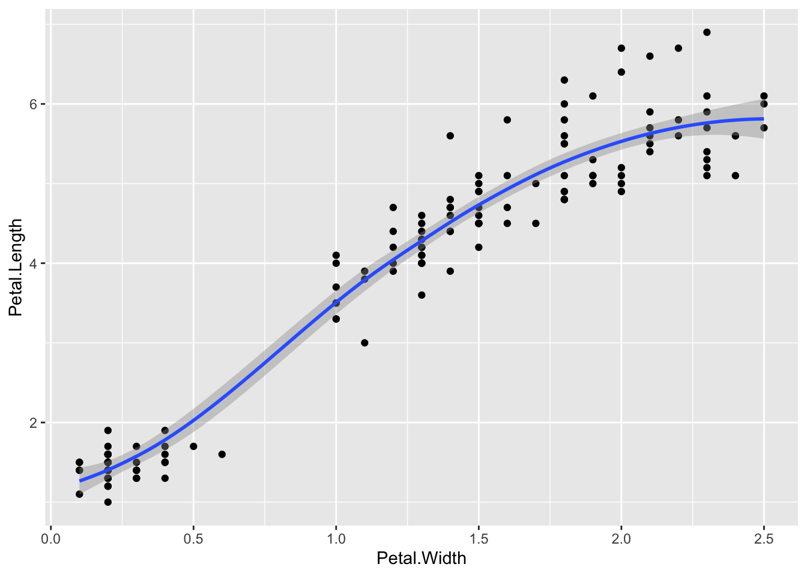
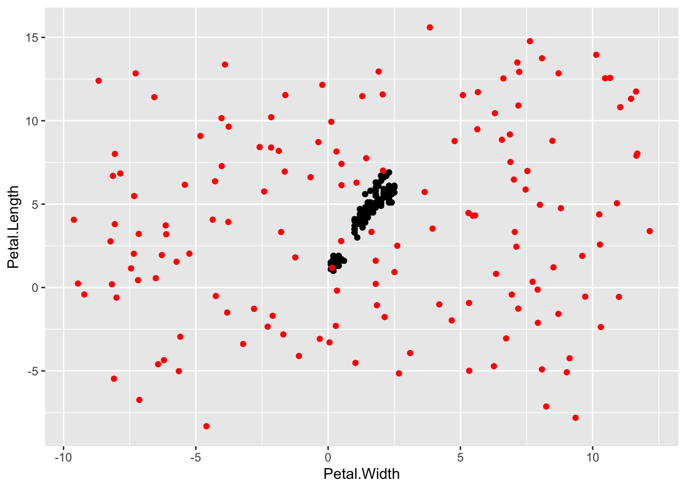
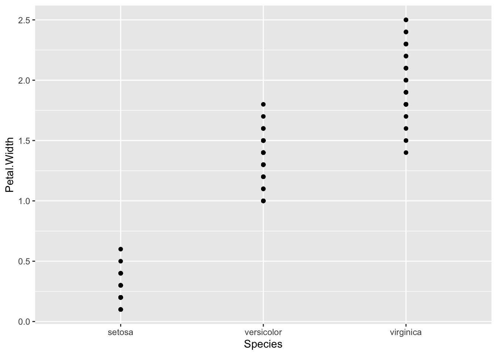

# Common Geoms

## About this chapter
1. Questions:
- What sorts of plot can I do?
2. Objectives:
- Demonstrate the main types of plot
3. Keypoints:
- There are geoms for continuous and discrete data
- Selecting and mixing these properly can give a nice representation of your data


## Continuous geoms
Let's look at some geoms that use continuous data on the x and y axis. 

### geom_smooth()
The built in geom `geom_smooth()` is a great one for getting a nice summary line through the data


```r
p <- ggplot(iris) + aes(Petal.Width,Petal.Length) + geom_point()
p + geom_smooth()
```

```
## `geom_smooth()` using method = 'loess' and formula 'y ~ x'
```


By default, this isn't a simple line of best fit, as you can see the smoothed line has curves! And it has a grey region that shows the standard error of the line. To get the standard line of the form `y=mx+c`, use


```r
p + geom_smooth(method = "lm", se = FALSE)
```

```
## `geom_smooth()` using formula 'y ~ x'
```


### What's the r<sup>2</sup>?
Having shown you how to put the line of best fit on the graph, you probably want to know how to get the equation and r<sup>2</sup> value. That takes a little bit of pure R. Here's how, using the `lm` linear model function. The syntax for this is `lm(y ~ x, dataset)` so for the iris data and the graph we just made (note the order Y and X is used in not the order X and Y)


```r
model <- lm(Petal.Length ~ Petal.Width, iris)
```

The result is now saved in the `model` variable we just created. This is a complex R object, which we can see a summary of using 


```r
summary(model)
```

```
## 
## Call:
## lm(formula = Petal.Length ~ Petal.Width, data = iris)
## 
## Residuals:
##      Min       1Q   Median       3Q      Max 
## -1.33542 -0.30347 -0.02955  0.25776  1.39453 
## 
## Coefficients:
##             Estimate Std. Error t value Pr(>|t|)    
## (Intercept)  1.08356    0.07297   14.85   <2e-16 ***
## Petal.Width  2.22994    0.05140   43.39   <2e-16 ***
## ---
## Signif. codes:  0 '***' 0.001 '**' 0.01 '*' 0.05 '.' 0.1 ' ' 1
## 
## Residual standard error: 0.4782 on 148 degrees of freedom
## Multiple R-squared:  0.9271,	Adjusted R-squared:  0.9266 
## F-statistic:  1882 on 1 and 148 DF,  p-value: < 2.2e-16
```
This is complex, but we want model coefficients, that is the `m` value - the slope (here 2.22994) and the `c` value - the intercept (here 1.08356), and the adjusted R-squared (0.9266)

> ## Shorthand notation
> A shorthand in ggplot allows you to leave out the `data=` part of the function call, if you put the data in the first position so
>
> `ggplot(iris)` is the same as `ggplot(data=iris)`
> 
> In the `aes()` function we can do the same. We can leave out the `x=` and `y=` parts and instead use the first two things in the function call for the x and y axis.
>
> So `aes(Petal.Length, Petal.Width)` is the same as `aes(x=Petal.Length, y=Petal.Width)`


### geom_jitter()

Sometimes, point plots get crowded, the points can get too close together, a visual problem called overplotting. A jitter plot lets us get over this by adding a random bit of noise to the position of the points. Here the points from the jitter geom are set to red.


```r
p + geom_point() + geom_jitter(colour="Red")
```


We can fiddle with the range of the jitter with `width` and `height` options


```r
p + geom_point() + geom_jitter(colour="Red", width=0.001, height=0.001)
```


conversely,

```r
p + geom_point() + geom_jitter(colour="Red", width=10, height=10)
```



The defaults are usually a good choice though.

### Changing opacity

Overplotting can be dealt with in other ways, changing the opacity of the geom is another. This is the `alpha` option. Choose the value in the range `0` to `1`, where `0` is invisible and `1` is solid


```r
p + geom_point() + geom_jitter(alpha=0.5) 
```


### geom_histogram()

Plotting a histogram is done with the `geom_histogram()`. The y value for this is calculated automatically, so you provide the x value.


```r
p <- ggplot(iris) + aes(Petal.Width)
p + geom_histogram() 
```

```
## `stat_bin()` using `bins = 30`. Pick better value with `binwidth`.
```


You can change the width of the bins with `binwidth`, or set the number of bins with `bins`

```r
p + geom_histogram(binwidth=0.5) 
```


```r
p + geom_histogram(bins=5) 
```


Trying to map the species to colour in this one gives us a weird sort of stacked histogram.


```r
p + geom_histogram(bins=5, aes(colour=Species, fill=Species),alpha=0.3 ) 
```


We can avoid this in a few ways, one is by using `geom_freqpoly()`, which is a line graph joining the tops of the bars of the histogram.


```r
p + geom_freqpoly( aes(colour=Species), bins=5 )
```


or with `geom_density()` which gives us smoothed lines from a kernel density estimate of the data (which is a way of generating a smooth curve over histograms). 


```r
p + geom_density( aes(colour=Species, fill=Species), alpha=0.3)
```


## Discrete geoms

Let's look at some geoms with categories on the x and numbers on the y axis. 

### geom_point() and geom_jitter()

Both these geoms can be used with categoric data in one dimension. This is a useful and very honest way of showing your data points.


```r
p <- ggplot(iris) + aes(x=Species, y=Petal.Width)
p + geom_point()
```



```r
p + geom_jitter()
```


### geom_boxplot() and geom_violin()

A great way to summarise the distributions of points is to use a boxplot in conjunction with the dots.


```r
p <- ggplot(iris) + aes(x=Species, y=Petal.Width)
p + geom_jitter() + geom_boxplot()
```


Which unhelpfully puts the newest layer on top. Reverse the order to see the points


```r
p + geom_boxplot(notch=TRUE) + geom_jitter()
```

```
## notch went outside hinges. Try setting notch=FALSE.
```


A common reason for using the boxplot is to use those notches to show the significant differences in the data. But really, these only help you assess a difference meaningfully if the data are normally distributed. In other circumstances you should be aware that the notches are misleading. Instead you can see the spread of your data much better with a violin plot.


```r
p <- ggplot(iris) + aes(x=Species, y=Petal.Width)
p + geom_violin() + geom_jitter() 
```


By turning your head to the side you can see the histogram curve / density distribution a bit more clearly. In fact ggplot has a way to flip a plot, one of a set of things called a transformation.


```r
p + geom_violin() + geom_jitter() + coord_flip()
```


Now you can see clearly that the setosa numbers are really badly bunched down at the lower end and a bit skewed by that. 

> ## Boxplots are best for normally distributed data. 
> Really, these boxplots, especially the ones with the notches only help you assess a difference if the data is nicely normally distributed
> ggplot
> 

## Quiz
1. Incorporate a jitter and notched boxplot into the Petal.Width and Species plots we already used: `ggplot(iris) + aes(Species,Petal.Width)...`
