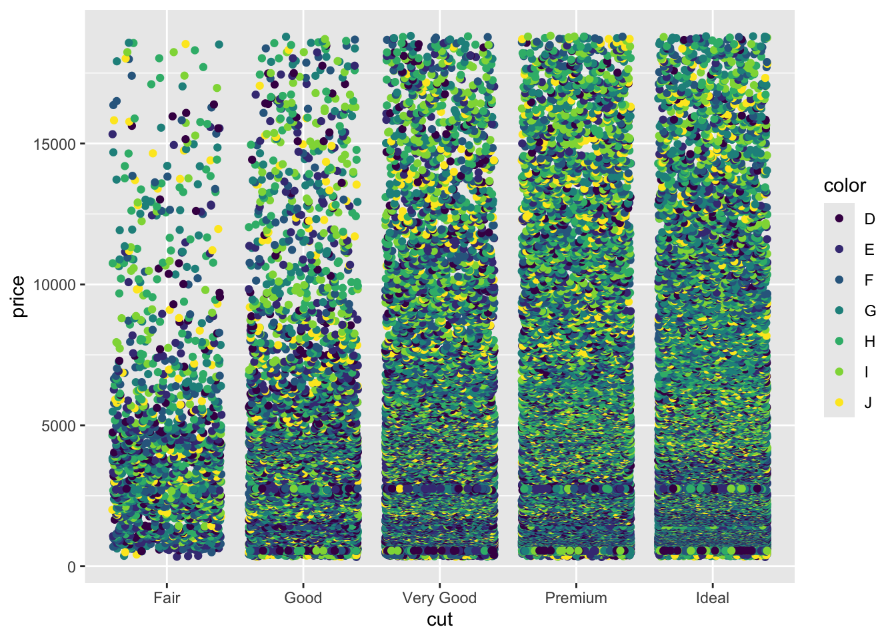
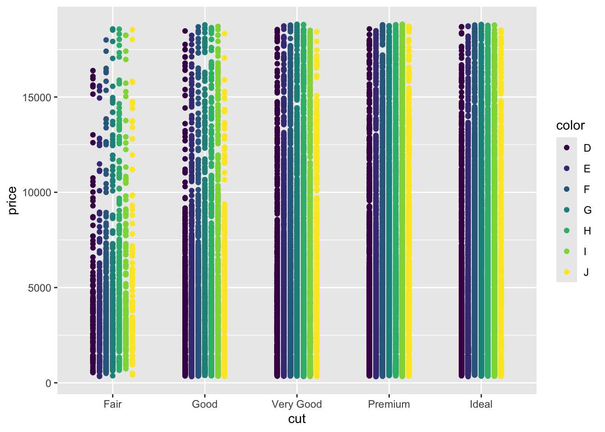

# Using Factors to Subset Data and Plots

## About this chapter
1. Questions:
- How can I make plots that compare multiple categories?"
2. Objectives:
- Understand factors
- Understand colouring and faceting on factors
- Use factors for summaries and plot design
3. Keypoints:
- A factor is a value of a categorical variable, or the different values a label can take
- Factors are needed to subset and add attributes to data dynamically

## Factors

In previous plots we've been using categories, specifically the `Species` category to split our data, colour our plots etc. These categorical columns are called Factors in R. Looking at the `diamonds` data set we can see how this is set up in R.


```r
head(diamonds)
```

```
## # A tibble: 6 x 10
##   carat cut       color clarity depth table price     x     y     z
##   <dbl> <ord>     <ord> <ord>   <dbl> <dbl> <int> <dbl> <dbl> <dbl>
## 1 0.23  Ideal     E     SI2      61.5    55   326  3.95  3.98  2.43
## 2 0.21  Premium   E     SI1      59.8    61   326  3.89  3.84  2.31
## 3 0.23  Good      E     VS1      56.9    65   327  4.05  4.07  2.31
## 4 0.290 Premium   I     VS2      62.4    58   334  4.2   4.23  2.63
## 5 0.31  Good      J     SI2      63.3    58   335  4.34  4.35  2.75
## 6 0.24  Very Good J     VVS2     62.8    57   336  3.94  3.96  2.48
```


Here we can see the `cut`, `color` and `clarity` columns are all non-numeric, textual data. These are the factor variables of this dataset. We can confirm that by asking for the `class` of the column, that is, the type of data in it. We use the dataset `$` column name syntax for this.


```r
class(diamonds$color)
```

```
## [1] "ordered" "factor"
```

```r
class(diamonds$depth)
```

```
## [1] "numeric"
```


We can also ask for all the different values of the factor, in R called the levels

```r
levels(diamonds$color)
```

```
## [1] "D" "E" "F" "G" "H" "I" "J"
```

```r
levels(diamonds$cut)
```

```
## [1] "Fair"      "Good"      "Very Good" "Premium"   "Ideal"
```
## Colouring by factors

Let's look at applying mappings by a factor. Let's look at how price varies by cut.


```r
p <- ggplot(diamonds) +  aes(cut,price) 
p + geom_jitter()
```


Now let's throw a second variable in there, lets see how color varies within each cut. We do this by creating a new aesthetic mapping within the geom_jitter()


```r
p + geom_jitter(aes(colour=color))
```



The spots are all overlapping, we can force the different colours to stay separate with the `position` option. We use `position_dodge()` to make them dodge each other. The width option tells the spots how far to stay apart.


```r
p + geom_jitter(aes(colour=color), position=position_dodge(width=0.5) )
```



We can also throw other geoms on top in the same way. EG Boxplots for each cut and colour


```r
p + geom_jitter(aes(colour=color), position=position_dodge(width=0.5) ) + geom_boxplot( aes(colour=color), position=position_dodge() )
```


Remember layers/geoms are independent, so can be set up to show individual aspects of the data. Let's have a boxplot for the whole of the cut, irrespective of the colour.

```r
p + geom_jitter(aes(colour=color),position=position_dodge(width=0.5)) + geom_boxplot() 
```


And of course, the whole thing still works even if we are comparing two numerical columns. We can still use the aesthetic mapping in the geom to colour our points by a factor


```r
ggplot(diamonds) + aes(carat, price) + geom_point(aes(colour=cut))
```


## Small multiple plots
Sometimes, trying to squeeze a lot of data into one plot isn't the clearest way to show it. Instead small multiple plots (different data, same settings) can be used. In ggplot, this is called faceting and is done with the `facet_wrap()` or `facet_grid()` function. We use the factors to define the facet.  Let's add faceting to the previous plot


```r
p <- ggplot(diamonds) + aes(carat, price) 
p + geom_point(aes(colour=cut)) + facet_wrap( ~ cut)
```


Here we see the plot is divided into panels, one for each 'cut'. The `facet_wrap()` function puts all the panels into a single row, but wll wrap that row as space demands. The syntax is a bit odd, we used the `~` operator to mean 'varies by' , even though we only used one variable. It's just a quirk of ggplot.

The `facet_grid()` function forces a grid structure and can take more than one factor. Now the `~` 'varies by' syntax makes more sense:

```r
p + geom_point(aes(colour=cut)) + facet_grid(color ~ cut)
```


## Quiz
The built in dataset `CO2` describes measurement of CO2 uptake versus concentration for Quebec and Mississippi grasses in chilled and nonchilled tests. The dataset is as follows:
  
  * `Type` is a factor column with two levels `Quebec` and `Mississippi`
  * `Treatment` is a factor colum with two levels `nonchilled` and `chilled`
  * `Uptake` is a numerical colum with CO2 uptake rate in micromoles per metre squared per second
  * `Plant` is a factor with twelve levels, one for each individual plant assayed.

1. Create a plot with `geom_point()` that shows the Plant on the _x_-axis and the Uptake on the _y_-axis. Colour the points by 'Type' and `facet_wrap()` by `Treatment` to get a subplot for chilled and nonchilled.

