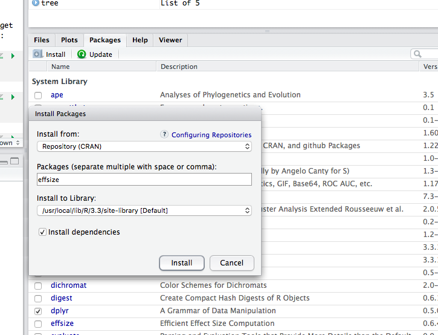

# ggplot2

The primary purpose of this handbook is to show you how to create clear and informative plots in the R package _ggplot2_. We will look at how _ggplot2_ is structured, how to prepare datasets for use in _ggplot2_ and how to customise plots. We will develop plots in R Markdown documents to aid reproducibility and re-use of plots.

## Prerequisites

No specific knowledge prerequisites for this book but it will help if you are familiar with some common statistical tests, `t`, `ANOVA` and regression for the later parts.
You will also find a knowledge of how to write computer file paths helpful.

You need to install the following stuff for this book: 

 1. R
 2. RStudio
 3. An R package: _ggplot2_
 4. You will need to download these files and save them to somewhere on your computer:
[diamonds.csv](files/diamonds.csv) and [example_ros_data_flg22.xlsx](files/example_ros_data_flg22.xlsx), 

## Installing R

Follow this link and install the right version for your operating system [https://www.stats.bris.ac.uk/R/](https://www.stats.bris.ac.uk/R/)

## Installing RStudio

Follow this link and install the right version for your operating system [https://www.rstudio.com/products/rstudio/download/](https://www.rstudio.com/products/rstudio/download/)

## Installing R packages in RStudio.
### Standard packages

Start RStudio and use the `Packages` tab in lower right panel. Click the install button (top left of the panel) and enter the package name, then click install as in this picture

